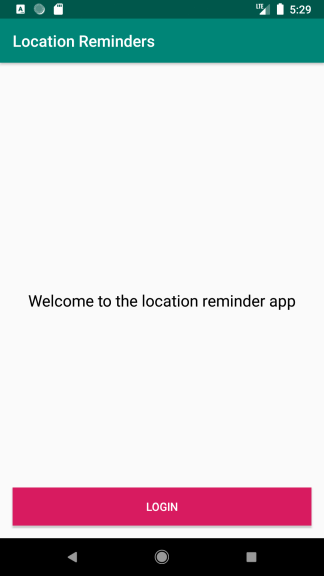
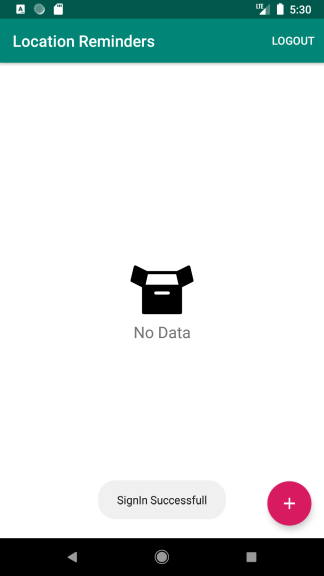
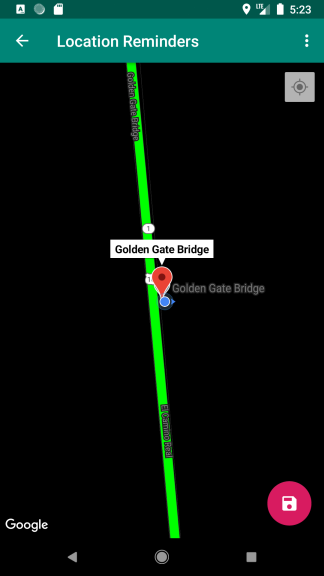
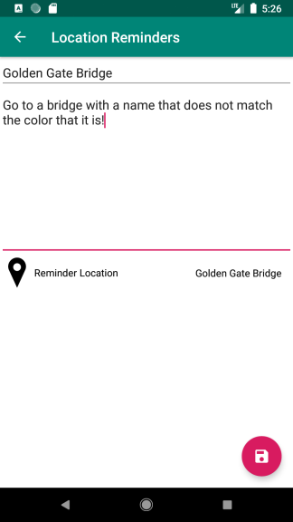
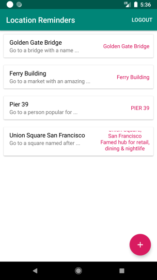
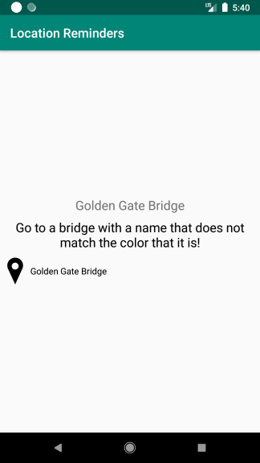

## Location Reminder

A Todo list app with location reminders that remind the user to do something when he reaches a specific location. The app will require the user to create an account and login to set and access reminders.

This app demonstrates the following views and techniques:

* [Koin](https://github.com/InsertKoinIO/koin) - A pragmatic lightweight dependency injection framework for Kotlin.
* [FirebaseUI Authentication](https://github.com/firebase/FirebaseUI-Android/blob/master/auth/README.md) - FirebaseUI provides a drop-in auth solution that handles the UI flows for signing
* [JobIntentService](https://developer.android.com/reference/androidx/core/app/JobIntentService) - Run background service from the background application, Compatible with >= Android O.
* [Geofences](https://developer.android.com/training/location/geofencing) allows you to define perimeters, also referred to as geofences, which surround the areas of interest.

* [ViewModel](https://developer.android.com/topic/libraries/architecture/viewmodel)
* [LiveData](https://developer.android.com/topic/libraries/architecture/livedata)
* [Data Binding](https://developer.android.com/topic/libraries/data-binding/) with binding adapters
* [Navigation](https://developer.android.com/topic/libraries/architecture/navigation/) with the SafeArgs plugin for parameter passing between fragments
* [Room](https://developer.android.com/training/data-storage/room) for local database storage.
* [ConstraintLayout](https://developer.android.com/training/constraint-layout) allows you to create large and complex layouts with a flat view hierarchy

* [JUnit4](https://junit.org/junit4/) a simple framework to write repeatable tests.
* [Robolectric](http://robolectric.org/) a framework that brings fast and reliable unit tests to Android.
* [Mockito](https://site.mockito.org/) mocking framework for unit tests in Java
* [Espresso](https://developer.android.com/training/testing/espresso) to write concise, beautiful, and reliable Android UI tests.

## Screenshots

 
 
 